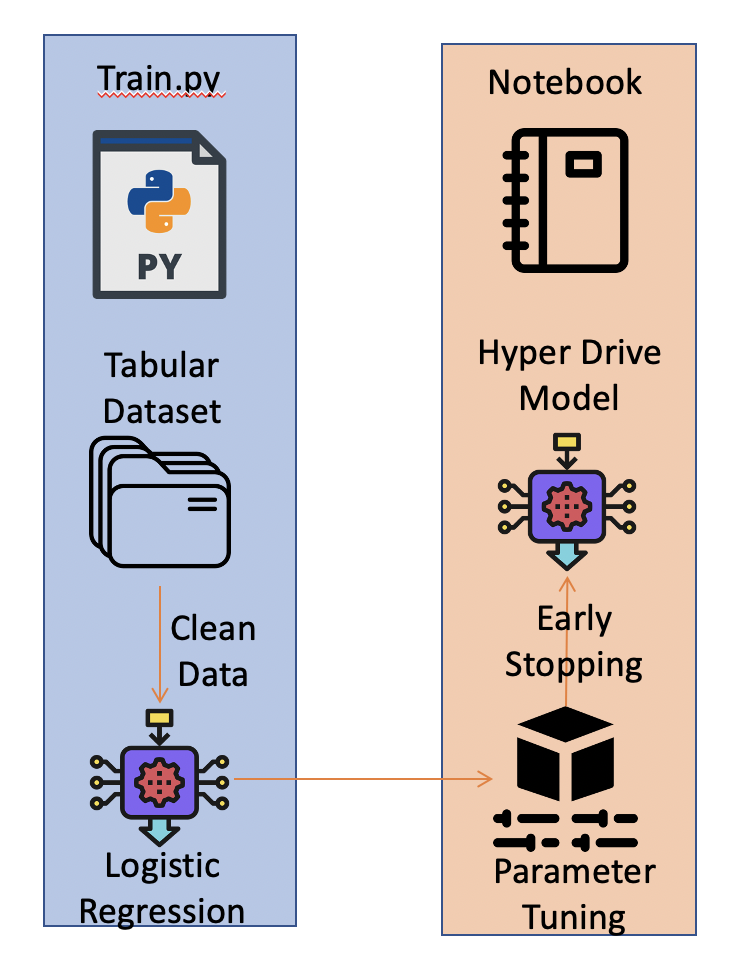
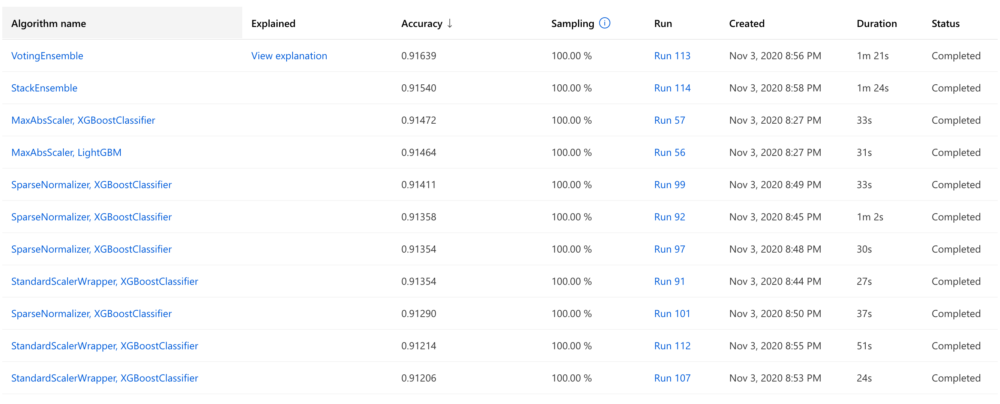
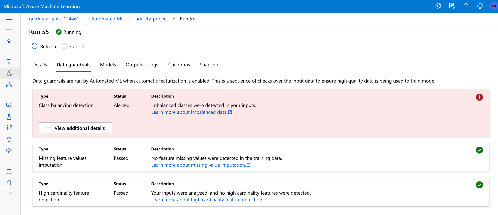
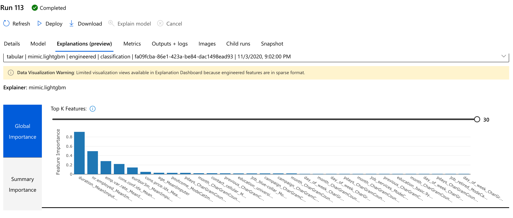

# Optimizing an ML Pipeline in Azure

## Overview
This project is part of the Udacity Azure ML Nanodegree.
In this project, we build and optimize an Azure ML pipeline using the Python SDK and a provided Scikit-learn model.
This model is then compared to an Azure AutoML run.

## Summary
### Problem Statement
The Problem at hand is that of classification. The dataset provided to me is hosted at the [path](https://automlsamplenotebookdata.blob.core.windows.net/automl-sample-notebook-data/bankmarketing_train.csv). 
For more information on the dataset you can visit here [here](https://archive.ics.uci.edu/ml/datasets/Bank+Marketing)
In this project I will utilize Azure ML services to predict if the client will subscribe to the term deposit or not with the bank.

### Solution
AutoML Model outperformed the model trained with the help of Hyperdrive. The reason could be the parameter sample space given to hyperdrive and also AutoML was able to try out several different models while in our Hyperdrive experiment we were using only Logistic Regression model.

## Scikit-learn Pipeline
**Explain the pipeline architecture, including data, hyperparameter tuning, and classification algorithm.**

First a training script was created called train.py. Within this script the following things were done:-
- TabularDatasetFactory was used to load the dataset.
- The data was cleaned and pre-processed. A function was written for this. The function consisted of the following steps:-  
  - Dropping null values
  - One-hot encode some of the features.
  - Separate the target values into its own dataframe
- The data was then split into train and testing set.
- A Logistic Regression model was fit on the training data. A number of hyperparameteres where provided to test the performance of the model. 
The hyperparameters include:
  - Regularization Strength(C)
  - Max iterations(max_iter)
  - Penalty(penalty)
  - Optimization Algorithm(solver)  

A workspace is launched and a cluster is created in Azure ML. A Hyperdrive was utilized in order to identify best possible hyperparameters for the Logistic Regression Model.

**What are the benefits of the parameter sampler you chose?**
Random sampling supports discrete and continuous hyperparameters. It supports early termination of low-performance runs and thereby reducing computation costs and speedup up the exploration of the parameter space

**What are the benefits of the early stopping policy you chose?**
Bandit policy is based on slack factor and evaluation interval. Bandit terminates runs where the primary metric is not within the specified slack factor compared to the best performing run. 
Slack factor is the slack allowed with respect to the best performing training run. 

## AutoML
**In 1-2 sentences, describe the model and hyperparameters generated by AutoML.**
The best model generated by AutoML is a VotingEnsemble method with a pre-processing step that uses. 
The VotingEnsemble consist of multiple models with varied weights, 'XGBoostClassifier', 'LightGBM', 'XGBoostClassifier', 'XGBoostClassifier', 'XGBoostClassifier', 'XGBoostClassifier', 'XGBoostClassifier', 'LightGBM', which use a MaxAbsScaler as pre-processing step. Other models are shown in the image below 

## Pipeline comparison
**Compare the two models and their performance. What are the differences in accuracy? In architecture? If there was a difference, why do you think there was one?**
The two best models found by HyperDrive and AutoML have an accuracy of 0.9123 and 0.9164. 
The difference in accuracy is as a result of AutoML's ability to search for the best algorithm and optimizing its parameters while in HyperDrive the user chose the algorithm and given set of hyperparameters.

## Future work
**What are some areas of improvement for future experiments? Why might these improvements help the model?**
An important problem that needs to be tackled to improve this project is class imbalance. 
This problem is also highlighted by AutoML as shown in this image 
As shown in the feature importance result we can remove some of the least importance feature to improve performance and reduce noise.

## Proof of cluster clean up
I have run the code for cleaning up the cluster so I have not included the screenshot.
